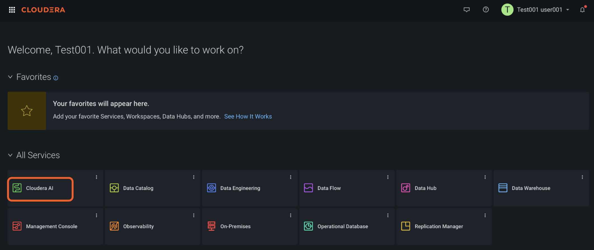

# Cloudera Agent Studio Hands On Lab

July 1st, 2026

**WELCOME!***


# Before You Begin

This lab is instructor guided. Please follow along with your instructor. 

Every lab is independent. If you don’t manage to complete one it will not stop you completing the rest. If you need help please raise your hand and an instructor will assist you. 

To review this lab at home with click by click directions please check out our guided tour: https://app.getreprise.com/launch/W6G3ON6/


# Getting Started

User assignment: 

Instructor will share your user assignment with you before getting started with the hands on lab
 
Login Credentials and URL: 

Shared ahead of the HoL or during the Session.

Getting to the lab

Step 1: Login with above login URL and that should bring you to below screen as shown in step-2.

Step 2: If there are any pop up’s for today’s lab, just dismiss them. You’ll see the following screen. Click on Cloudera AI. 

<br/>

 <br/>

Step 3: From the earlier step, you were given the workspace. Makes you pick the right workspace.

Click into the workspace based on your username. Please do not select any other workbench as this could disturb the workload management.  

user 001 to user020 -> nemea2-ml-wb01
user021 to user040 -> nemea2-ml-wb02
user041 to user060 -> nemea2-ml-wb03
user061 to user080 -> nemea2-ml-wb04
user081 to user100 -> nemea2-ml-wb04


This repository contains all documentation and artifacts to setup the new genAI Hands on Workshop.

The exercise guide (Labs) can be found in this readme markdown file.

## Project Structure

The project is organized with the following folder structure:

```
.
├── code/              # Backend scripts, and notebooks needed to create project artifacts
├── data/              # data that needs to be loaded into the warehouse
├── images/            # A collection of images referenced in project docs
├── tools /            # python tools that need be loaded into the tool template
```

## Use Case Intelli Banking

<br/>

 <br/>
