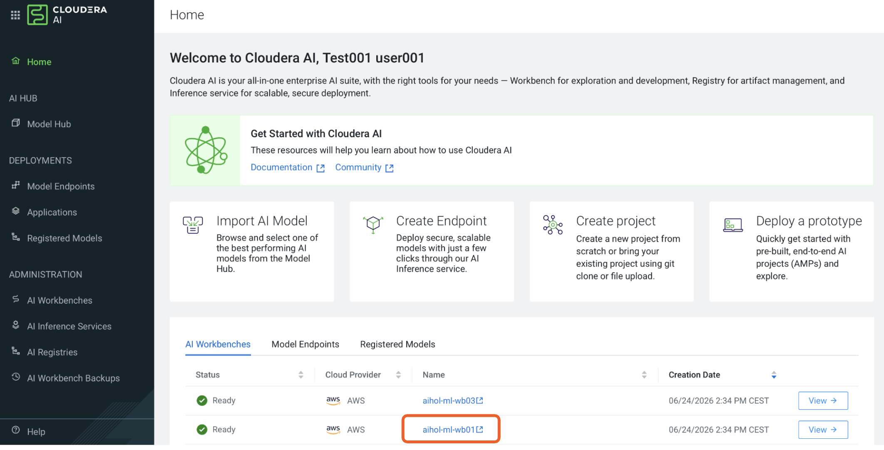
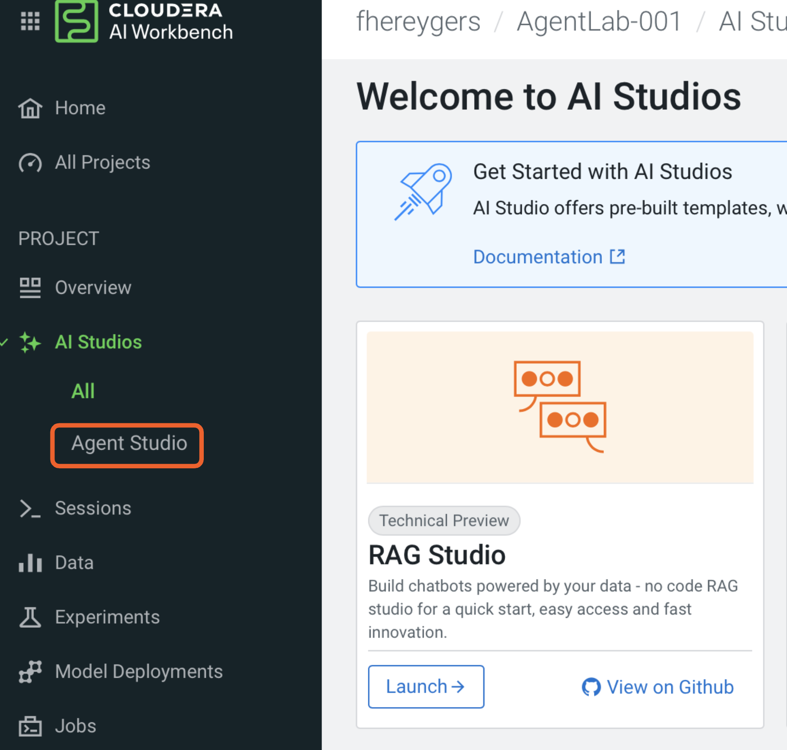
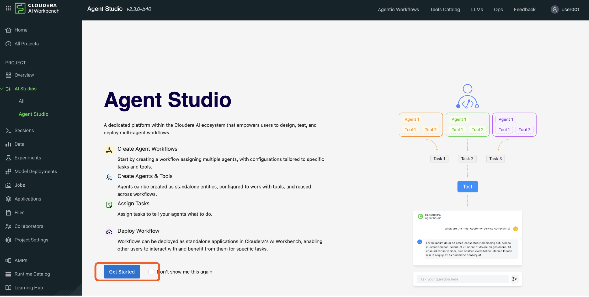

# Cloudera Agent Studio Hands On Lab

July 1st, 2026

**WELCOME!**

This document will be your exercise guide and will contain all information about the Labs, except for Links to the envirnoment and passwords.

These can be found in the chatbox of the meeting.


# Before You Begin

This lab is instructor guided. Please follow along with your instructor. 

Every lab is independent. If you don’t manage to complete one it will not stop you completing the rest. If you need help please raise your hand and an instructor will assist you. 

To review this lab at home with click by click directions please check out our guided tour: https://app.getreprise.com/launch/W6G3ON6/


# Getting Started

User assignment: 

Instructor will share your user assignment with you before getting started with the hands on lab
 
Login Credentials and URL: 

Shared ahead of the HoL or during the Session.

# Getting to the lab

**Step 1**: Login with the shared login URL and that should bring you to below screen as shown in step-2.

**Step 2**: If there are any pop up’s for today’s lab, just dismiss them. You’ll see the following screen. Click on Cloudera AI. 

<br/>

 <br/>

**Step 3**: From the earlier step, you were given the workspace. Makes you pick the right workspace.

Click into the workspace based on your username. Please, do not select any other workbench as this could disturb the workload management.  

user 001 to user020 -> nemea2-ml-wb01

user021 to user040 -> nemea2-ml-wb02

user041 to user060 -> nemea2-ml-wb03


<br/>

<br/>


You will see your project. Click into it. 

<br/>

<br/>

Using the left navigation pane, click on Agent Studio

<br/>

<br/>

Clicking on Agent Studio should bring you to the screen below and click on option “Dont show this again”, then get started.

<br/>

<br/>

**Awesome! We are set to go!**

# Lab1: Basic Calculator and Introduction

##Lets walk through the following steps

**Step 1**: Click on “Create workflow”

<br/>

<br/>

**Step 2**: Provide Workflow Name “**Lab1: Calculate**” 

<br/>

<br/>

**Step 3**: Add your first agent 

<br/>

<br/>

**Step 4**: Generate Agent Prompt with “Generate with AI” option

<br/>

<br/>

**Step 5**: Enter the following, then click on the blue button.

Prompt = “You are an expert at calculating financial formulas”


# The End 

```
.
├── code/              # Backend scripts, and notebooks needed to create project artifacts
├── data/              # data that needs to be loaded into the warehouse
├── images/            # A collection of images referenced in project docs
├── tools /            # python tools that need be loaded into the tool template
```

## Use Case Intelli Banking

<br/>

 <br/>
